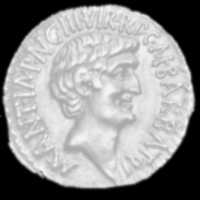
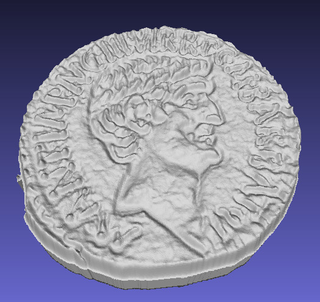
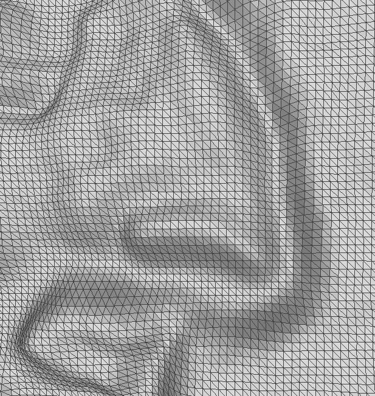

# png2stl – Convert PNG height maps into STL models

<p style="text-align:center;">
	
  <span style="font-size:48px; vertical-align:middle; margin:0 16px;">⟶</span>
  
</p>

## Overview
`png2stl` converts grayscale PNG images into 3D STL files using pixel brightness as height information.
This allows you to quickly generate height maps suitable for 3D printing or further mesh processing.

- **Input**: A grayscale PNG image.
  Pixel values are mapped to surface height:
  * Black (`0`) represents the lowest elevation.
  * White (`255`) represents the highest elevation.
  * Intermediate gray values produce proportional heights.

- **Output**: An STL file that can be loaded into slicers or 3D design tools for printing.

## Options and Notes
- `--nonrect`: Ignores black pixels (`0`) at the image boundary, producing non-rectangular meshes.
- `--noboundary`: Removes the outer boundaries, leaving only a height-map
- `--height`: Set the height of the model in milimeters
- `--size Width Height`: Sets the output model dimensions in millimeters
- `--outstl <filename>`: Specifies the output STL file name.
- `--image <image.png>`: Specifies the input image path
**TODO: rename pic_height and explain better**

> ⚠️ **Tip**: For best results, start with a clean, high-contrast grayscale PNG.
Improve the tips


---

## Examples

### Low resolution circle
```bash
python png2stl.py --image examples/circle.png --nonrect --outstl circle.stl --height 2
```

### Circle without the boundaries

```bash
python png2stl.py --image examples/circle.png --nonrect --outstl circle.stl --height 2 --noboundary
```

### A Roman coin
```bash
python png2stl.py --image examples/coin.png --height 3 --size 20 20 --nonrect --outstl coin.stl
```

<p style="text-align:center;">
  
</p>


# Changlog
* 22-02-21 - Added support for non-rectangular shapes
  	     Have a "bug" of the size of the shape
* 25-09-27 - Fixed holes in mesh
* 25-09-27 - Added --noside and --nobottom options
* 25-09-27 - Added pre-commit hooks
* 25-09-27 - Fixed bug: geometry is flipped

# Development

Set up a virtual environment and install runtime dependencies:

```bash
python -m venv .venv-png2stl
source .venv-png2stl/bin/activate
pip install -r requirements.txt
```

Install and run the pre-commit hooks before committing changes:

```bash
pip install pre-commit
pre-commit install
pre-commit run --all-files
```

The hook set runs `black`, `ruff`, and `mypy` so the codebase stays formatted, linted, and type-checked automatically.

# TODO
* Documentation
* Add tests
